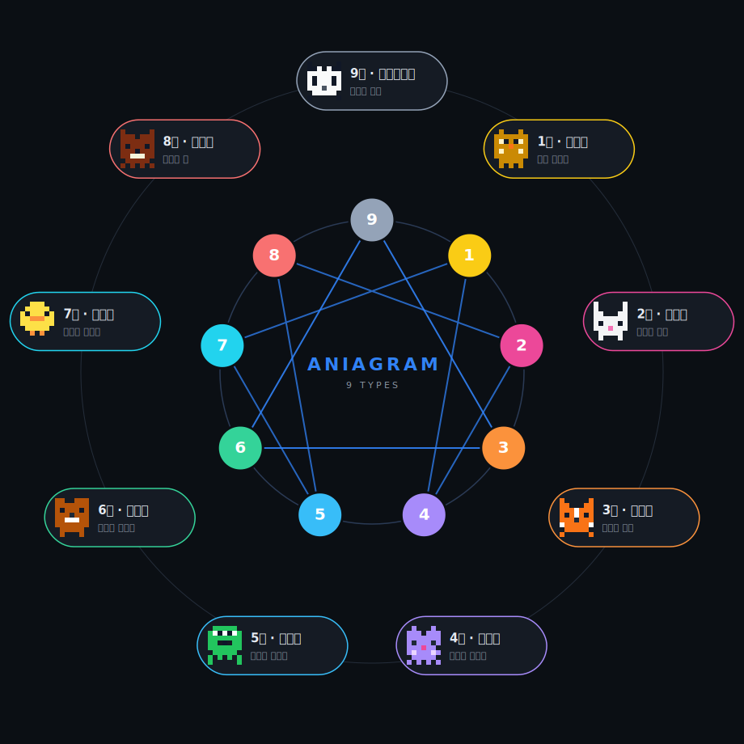

<div align="center">


# Aniagram Team

**직장인을 위한 에니어그램 팀 궁합 서비스**

3분 테스트로 내 유형을 찾고, 팀을 초대해 궁합·시너지·회사 비유를 한눈에 확인해요.

[**서비스 바로가기 → aniagram-team.web.app**](https://aniagram-team.web.app)

[](https://vitejs.dev/)
[](https://react.dev/)
[](https://firebase.google.com/)
[](./LICENSE)

</div>

---

## ✨ 이런 서비스예요

- **나에게 맞춘 12문항** — 공통 6 + 내 직군 맞춤 6 문항을 조합해요. 개발자 · 디자이너 · PM · 기획 · 마케터 · 데이터 · 영업 · HR · 기타 직군별로 질문이 달라요.
- **결과를 바로 공유** — 내 결과를 카드 이미지로 저장하거나 링크로 친구에게 공유할 수 있어요.
- **팀 궁합 대시보드** — 최대 10명까지 한 팀을 만들어 서로의 에니어그램 유형이 어떻게 어우러지는지 봐요. 팀 코드(6자)로만 초대되고, 7일 뒤 자동 만료돼요.
- **회사 비유 분석** — 팀 전체 성향 벡터를 9차원 코사인 유사도로 계산해 “우리 팀은 어떤 회사를 닮았는가?”를 뽑아줘요.
- **페어별 케미 매트릭스** — 누가 누구와 잘 맞는지/긴장할 수 있는지를 한 줄 이유와 함께 보여줘요.
- **예쁜 8비트 동물 캐릭터** — 9가지 유형마다 성격을 반영한 픽셀 아트 동물이 배정돼요. _(결과 화면에서 탭하면 이스터에그가…🤫)_

## 🐾 9가지 에니어그램 동물

<div align="center">



</div>

> 9번을 꼭대기에 두고 시계 방향으로 1~8을 배치한 전통 애니어그램 배열이에요. 내부 삼각형(9-3-6)과 헥사드(1-4-2-8-5-7)는 유형 간 성장·스트레스 관계 라인을 나타내요. 각 동물은 `src/data/animals.ts` 의 8비트 픽셀 그리드 + 팔레트로 정의되고, 그래프와 개별 동물 SVG는 `scripts/generate-enneagram-svg.ts`, `scripts/generate-animal-svgs.ts` 로 동일 데이터에서 자동 생성돼요.

## 🧭 어떻게 작동하나요?

```
역할 선택 → 12문항 (공통 6 + 직군 6, 선지 순서 랜덤)
         → 2/1점 가중치로 9유형 점수 집계 (useRef 로 stale closure 방지)
         → 결과는 localStorage 에만 저장 (Firestore X)
         → 팀 생성/참여 시점에만 Firestore 에 멤버 문서 기록
         → 대시보드는 멤버 배열을 받아 브라우저에서 순수 TS 로 분석
```

Firestore 는 저장소 역할만 해요. 모든 성격 분석, 궁합 스코어링, 회사 비유 매칭은 **서버리스, 클라이언트 순수 함수**로 계산돼요. (`src/lib/analysis.ts`)

## 🛠 기술 스택

| 레이어 | 도구 |
|--|--|
| 프레임워크 | React 18 + TypeScript 5 |
| 빌드 | Vite 5 |
| 스타일 | Tailwind CSS + 자체 디자인 토큰 (`src/data/design.ts`) |
| 라우팅 | React Router 6 |
| 인증 | Firebase Auth (익명 + 구글) |
| 데이터베이스 | Cloud Firestore (rules로 접근 제어) |
| 호스팅 | Firebase Hosting |
| 이미지 내보내기 | html-to-image (결과 카드 PNG 저장) |

## 🚀 로컬에서 돌려보기

```bash
# 1) 설치
npm install

# 2) Firebase config 설정
cp .env.example .env.local
# .env.local 열어서 본인 Firebase 프로젝트의 웹 앱 설정값을 채워넣어요.
# (Firebase Console → 프로젝트 설정 → 일반 → 내 앱 → SDK 스니펫 → 구성)

# 3) dev 서버
npm run dev
```

주요 스크립트:

```bash
npm run dev        # Vite dev 서버
npm run build      # 타입 체크 + 프로덕션 빌드 (dist/)
npm run lint       # 타입 체크만
npm run preview    # 빌드 결과물 미리보기
npm run deploy     # 빌드 후 Firebase 배포 (Firestore rules + Hosting)

npx tsx scripts/verify-scoring.ts        # 문항별 유형 분포 검증
npx tsx scripts/generate-animal-svgs.ts  # README용 동물 SVG 재생성
```

## 🔐 Firebase 프로젝트 세팅 (포크해서 돌릴 때)

1. [Firebase Console](https://console.firebase.google.com/) 에서 새 프로젝트 생성
2. **Authentication** → 익명 로그인 + Google 제공업체 활성화
3. **Firestore Database** → 새 데이터베이스 (Native 모드)
4. 프로젝트 설정 → 일반 → “웹 앱 추가” → 설정값을 `.env.local` 에 복사
5. 본인 프로젝트 별칭 설정:
   ```bash
   npx firebase login
   npx firebase use --add   # 새 프로젝트 선택, 별칭 default
   ```
6. 배포:
   ```bash
   npm run deploy
   ```

### ⚠️ 보안 노트

- Firebase 웹 API 키는 **시크릿이 아니에요**. 브라우저 번들에 그대로 들어가고, 보안은 [Firestore Security Rules](./firestore.rules)로 강제돼요.
- 그래도 남용 방지를 위해 **Google Cloud Console → API & Services → Credentials** 에서 해당 API 키에 **HTTP Referrer 제한** (자신의 도메인만 허용)을 거는 걸 강력히 권장합니다.
- `.env.local` 은 gitignore 되어 있어요. 본인 config는 로컬에만 두세요.

## 🗂 프로젝트 구조

```
src/
  pages/           # 라우트 페이지 (Start, RoleSelect, Quiz, Result, TeamCreate, TeamDashboard, ...)
  components/      # 재사용 UI (PixelAnimal, AnimalEasterEgg, Card, Btn, 차트 ...)
  data/
    questions/     # 직군별 문항 풀 + common
    enneagram.ts   # 9유형 메타 정보, REL 표, CENTERS/STYLES
    metaphors.ts   # 회사 비유 9차원 벡터
    animals.ts     # 8비트 픽셀 스프라이트
    design.ts      # 다크 테마 팔레트 토큰
  lib/
    analysis.ts    # 궁합 · 회사 비유 · Wing · 순위 계산 (pure TS)
    teams.ts       # Firestore 팀 CRUD + 구독
    auth.tsx       # Firebase Auth Provider
firestore.rules    # 코드/팀/멤버 접근 규칙 — 보안의 핵심
scripts/
  verify-scoring.ts         # 문항 균형 검증
  generate-animal-svgs.ts   # README용 SVG 생성
docs/animals/      # 생성된 동물 SVG (README 표시용)
```

## 🤝 기여하기

이슈와 PR 환영해요. 문항을 추가하거나 새 직군을 넣는 경우:

1. `src/data/questions/<role>.ts` 에 문항 추가
2. `src/data/questions/index.ts` 에서 직군 매핑
3. `npx tsx scripts/verify-scoring.ts` 로 유형 분포 skew 체크
4. PR 설명에 변경된 직군과 분포 확인 결과 포함

새 기능 PR은 `npm run lint` (= `tsc -b --noEmit`) 통과가 필수예요. 테스트 프레임워크는 따로 없고, `verify-scoring.ts` 가 그 역할을 해요.

## 📝 라이선스

[MIT](./LICENSE) — 자유롭게 쓰고, 수정하고, 배포하세요. 다만 “Aniagram Team” 서비스의 데이터(회원/팀)는 원본 서비스 운영자 책임이며, 본인 인스턴스를 돌릴 땐 본인의 Firebase 프로젝트에서 관리해주세요.

---

<div align="center">
<sub>Made with 🐰🦊🐻 by <a href="https://github.com/KoreanTuna">@KoreanTuna</a></sub>
</div>
